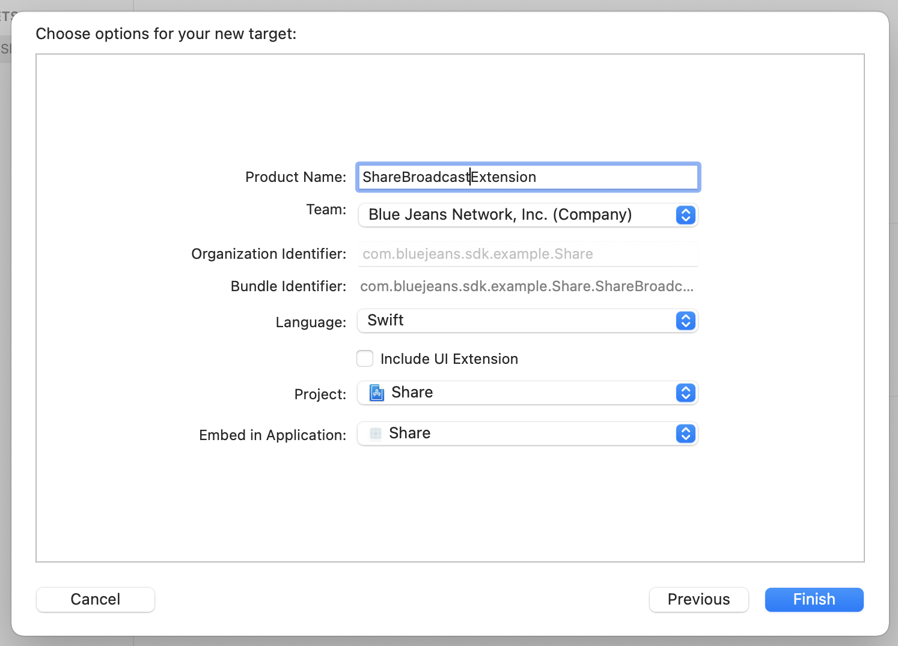
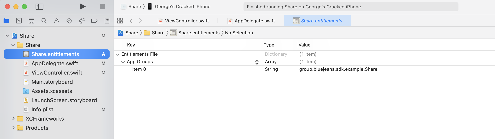

# Content Sharing Guide

*Screen sharing on iOS is fairly involved and requires app-level configuration that the SDK cannot provide. This document lays out the steps to get screen sharing support working.*
 
- [Create a broadcast extension](#create-a-broadcast-extension)
- [Set up App Groups](#set-up-app-groups)
- [App set up](#app-set-up)
- [Next steps](#next-steps)

Screen sharing in the BlueJeans SDK makes use of iOS level support for screen sharing. This allows the screen of the device to be captured, even if your app is in the background. To do this, you need to create a broadcast extension in your project. This extension is a separate process, run by iOS. For more detail on broadcast extensions, how they work and their limitations, see [this WWDC video](https://developer.apple.com/videos/play/wwdc2018/601/). In the steps below, we detail how to create a broadcast extension, how to configure it to communicate with your app and BlueJeans.


## Create a broadcast extension
First you will need to create a broadcast extension. This is a separate target in your app. This extension will need its own bundle id and provisioning profile to be created.

1. With your application project open in Xcode, select File → New → Target.
1. Select Broadcast Upload Extension, and choose a name for the broadcast extension. You do not need to include a UI Extension
1. Select your application under "Embed in Application". If you are manually managing code signing, you will need to create a provisioning profile for this extension via the Apple developer portal. If Xcode is managing code signing, it will be created automatically.



Next, select the newly created broadcast upload extension target in your project. You will need to link the following xcframeworks from the SDK:
- CocoaLumberjack
- CocoaLumberjackSwift
- MMWormhole
- BJNiOSBroadcastExtension

The standard broadcast extension requries a class that sub-classes `RPBroadcastSampleHandler`. The `BJNiOSBroadcastExtension` xcframework supplies the `BJNSampleHandler` class that can be used directly in your extension without modification as follows:

``` swift
import ReplayKit
import BJNiOSBroadcastExtension
 
class SampleHandler: BJNSampleHandler {}
```

In the initial stages of setting up screen sharing, it is not recommended to sub-class BJNSampleHandler. However once it is working, you may wish to sub-class this method to add some of your own logic here. It is important to consider the following:
- All super methods from the BJNSampleHandler class must be called.
- The extension has a low memory limit of 50MB. A reasonable portion of this is already needed to handle the processing of incoming frames. iOS will kill the extension if it exceeds the specified memory limit, so be very careful with memory allocations.

## Set up App Groups

The next step is to ensure the broadcast extension and your app can communicate. This is done via App Groups (more detail [here](https://developer.apple.com/documentation/bundleresources/entitlements/com_apple_security_application-groups)). The following steps describe how an app group can be created in Xcode. Much of this can also be done via the developer portal (especially if you are manually managing your provisioning profiles).

In Xcode:
- Select your project in the project navigator, and go to the "Signing & Capabilities" tab. Select your app target.
- Choose "+ Capability", followed by "App Groups"
- Use the "+" button to create a new app group. 
- Make sure the App Group is selected for your app. This should update (or create, if needed) your entitlements file with the associated app group. Switch to the extension target, and also select the same app group.
- If Xcode is managing code signing, it should automatically re-generate the provisioning profiles for both targets. If not, you will need to do this through the developer portal.
- At this stage, the entitlements files for both target should have something similar to the screenshot below:


 
*This stage is very important - without the correct setup here the app will not be able to receive frames from the extension, and screen sharing will not work.*

The SDK can automatically setup the connection between app and extension at run time, but needs some configuration information. This is done by adding the following key/value pairs to your info plist:
To both the app and extension plist:
- Add a string entry, with a key of BJNScreenSharingAppGroup and the value set to the app group id generated above.
To only the app plist:
- Add another string entry, with key of BJNScreenSharingBundleID and the value set to the bundle id of your broadcast upload extension.

## App set up
We are now ready to add logic the your app to start, stop and otherwise manage screen sharing. The SDK exposes a property `contentShareAvailability`. It is important to observe this property. You need to ensure that screen sharing is available before exposing any UX to start a screen share. 

There are multiple reasons screen sharing may not be available, for example if you are not in a meeting, no other participants are present or if the moderator has disabled screen sharing.


Assuming screen sharing is available, Apple provide a piece of system UI to initiate screen sharing. This can be done using something like the following:

``` swift
let pickerViewDiameter: CGFloat = 44
let pickerView = RPSystemBroadcastPickerView(frame: CGRect(x: 0, y: 0,
                                                           width: pickerViewDiameter,
                                                           height: pickerViewDiameter))
 
pickerView.preferredExtension = "Your Broadcast Upload Extension id"
 
// Microphone audio is passed through the main application instead of
// the broadcast extension.
pickerView.showsMicrophoneButton = false
 
view.addSubview(pickerView)
 
// Setup layout constraints
```

This creates a button which will bring up the system UX to initiate screen sharing. The "preferredExtension" property ensures that your app will receive the captured frames. Without it the system will ask the user to choose which extension (there may be several installed on a user's device).
That was quite a lot of set up, but at this stage it should be possible to join a meeting, and if available, begin screen sharing. 

Screen sharing can be stopped in several ways, through the SDK (see below), through the system control panel, or by tapping on the red status bar that iOS displays when screen sharing is active.
Screen sharing works at the device level, and so will capture the screen even when your app is backgrounded. *One caveat here - it is important that your app is still running in the background. This should already be the case as described in the initial get started documentation for the SDK.*

## Next steps
Once screen sharing is active, you can stop it at any time using BJNVideo.stopScreenShare().
The SDK provides the following properties for you to observe:
 
- `contentShareAvailability` - used to determine if screen sharing is allowed for the user in the current meeting.
- `contentShareExtensionStatus` - identifies what set screen sharing is in currently.
- `contentShareStopReason` - sharing can be stopped for a number of reasons, this property provides context to better inform the user.

Screen sharing can also be configured through an object conforming to ContentShareParametersProtocol as follows:

``` swift
struct ContentShareParameters: ContentShareParametersProtocol {
    var requireConfirmationBeforeHijacking: Bool
    var messageProvider: MessageProvider = {( stopReason, availability ) -> String in return "Message for stop reason: \(stopReason.rawValue) and availability: \(availability.rawValue)"}
}
```

If the field requireConfirmationBeforeHijacking is set to false, then initiating screen share will take over any existing screen share.
If set to true, then the following will happen:
- If no one is sharing, then screen sharing will begin as normal, otherwise:
    - Screen sharing will not start immediately. 
	- The `contentShareExtensionStatus` property will instead change to `.waitingForConfirmation`.
	- At this stage, the user should be prompted to confirm they want to take over screen sharing from the other participant. 
	- Based in the user response, the app should call either `stopContentShare()` or `confirmContentShare()`. 
	- If `confirmContentShare()` is called, screen sharing will begin, replacing the other participant's share.

The messageProvider variable allows the app to provide the user a meaningful alert if sharing is stopped for an unexpected reason (for example stopped by the moderator, or another user has taken over sharing).
