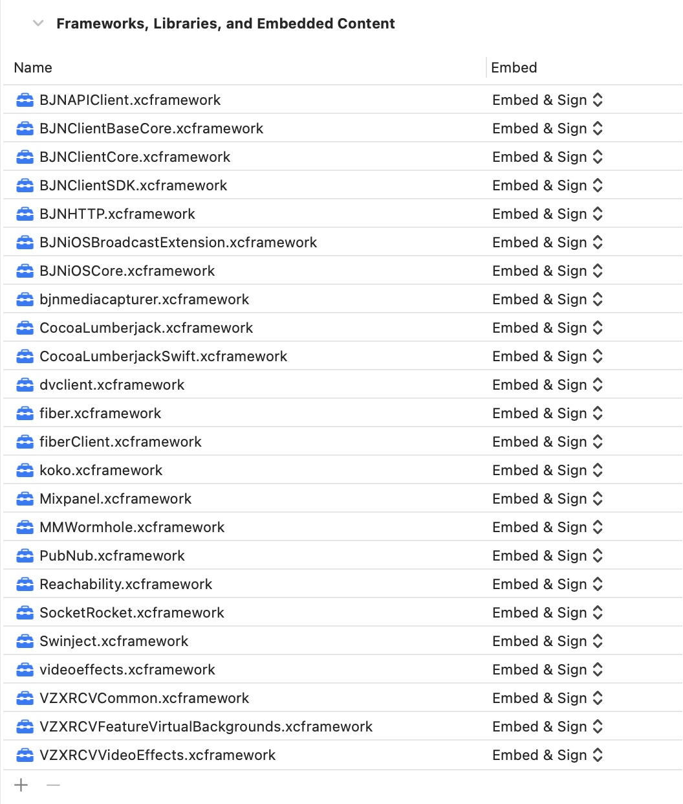

[](https://www.bluejeans.com "BlueJeans iOS Client Software Development Kit")

# BlueJeans iOS Client Software Development Kit

The BlueJeans iOS Client Software Development Kit (SDK) enables the embedding BlueJeans Video and Audio capabilities into iOS apps. `BlueJeansSDK` is a single namespace that encapsulates all the API's related to establishing and managing a BlueJeans Video and Audio connection.

The design of the SDK emphasizes **simplicity**. Developers can quickly integrate BlueJeans video into their applications.

## Features
- Audio and Video Permission handling
- Join, End Meeting
- Self Video
- Remote Video, Remote Video states
- Content receive 
- Audio and Video self mute
- Orientation handling
- Toggle front / back camera
- Video Layout switch
- Participant list
- Participant properties: Audio mute state, Video mute state, is Self, Name and Unique Identifier
- Self Participant
- Screen Share
- Log Upload
- Multi-stream support ("Sequin" Video Layouts)
- Public and Private meeting Chat
- Remote Video and Content mute
- Meeting Information (Title, Hostname, Meeting Id, Participant passcode)

## Current Version: 1.0.0

## Pre-requisites
This framework requires ***Swift 5.4*** and ***Xcode 12.5***. Module stability will be provided in a future release. 

Target deployment requires a minimum of *iOS version 13.0*.

There are additional software dependencies on frameworks as mentioned in the [**Dependencies**](#dependencies) section. All dependent frameworks are included as part of the frameworks bundle.

## API Architecture
[TBD]


## SDK Documentation
Detailed documentation of SDK functions is available[here](Docs/index.html).

## How do I start?
You can experience BlueJeans meetings using the iOS client SDK by following the two steps below:

### Generate a meeting ID
As a prerequisite to using the BlueJeans iOS Client SDK to join meetings, you need a BlueJeans meeting ID. If you do not have a meeting ID then you can create one using a BlueJeans account:

   - Sign up for a BlueJeans Account either by opting in for a [trial](https://www.bluejeans.com/free-video-conferencing-trial) or a [paid account](https://store.bluejeans.com/)
   - Once the account is created, you can schedule a meeting either by using the account or through the [direct API](https://bluejeans.github.io/api-rest-howto/schedule.html) calls. In order to enable API calls on your account, please reach out to [support team](https://support.bluejeans.com/s/contactsupport).

### Integrate BlueJeans iOS Client SDK
Integrate the SDK using the below guidelines and use SDK APIs to join a meeting using the generated meeting ID. 

## Integration Steps
### Manual

Steps:

1. Download `ios-client-sdk.zip` 
2. Unzip the file and copy `ios-client-sdk` folder to the root folder where Xcode project(*xxxx.xcodeproj* file) is located.
3. Open the Xcode project, click on the project build settings and select the *App target -> General Tab*.
4. Scroll to ***Embedded Binaries*** section of Xcode target.
5. Select all frameworks found in `ios-client-sdk/XCFrameworks` folder *except BlueJeansSDK.xcframework*.
6. Drag and drop all frameworks present in `ios-client-sdk/Frameworks` folder to this section. Make sure the project settings looks like below image after adding it.



### SPM, Carthage and Cocoapods

Other dependency managers, such as the Swift package manager, Cartjage or Cocoapods are not currently supported.

### Upgrade Instructions
Whenever a newer version of SDK is available, you can consume it by replacing the xcframeworks with the newer versions.

## Setup

#### Bitcode Support
BlueJeans iOS Client SDK cannot support bitcode. To integrate this SDK into your application, you will have to disable bitcode for the target. 

To disable bitcode:

1. Go to Build Settings tab of Xcode application target in Xcode project settings. 
2. Search for ***"Enable Bitcode"*** 
3. Change the value to ***"No"***

#### Manual Copy Frameworks Script
The iOS Client SDK relies on a framework named BlueJeansSDK which is built only for real devices. In order for your app to work for both simulator and real devices, you must not embed this framework in the normal way. Instead use the provided embed-device-only-framework.sh script as a Run Script phase at the end of the build. This should copy the BlueJeansSDK framework at build time. You should have a run script build phase as pictured.

[TBD update image with "correct" path]


If you only want to use the app on physical devices you can skip this step and just embed the BlueJeansSDK framework like all of the others. 

#### User Permissions
In iOS, the user must explicitly grant app permission to access device cameras or microphones for video, or audio capture. Your app must provide an explanation for its use of these capture devices. Failure to do so will result in a crash.

Audio/Video permissions must be requested by the App developer *before* the first meeting join otherwise audio *will not work for the first meeting*, this should be done at a time convenient to the user. See the [Apple Documentation](https://developer.apple.com/documentation/avfoundation/cameras_and_media_capture/requesting_authorization_for_media_capture_on_ios) for details on how to do this, or use the helper methods in BlueJeansSDK.PermissionService [TBD link]

Open your application's `Info.plist` and provide a short explanation for both of these `Info.plist` keys: 

- ***NSCameraUsageDescription*** *(Privacy - Camera Usage Description)* 
- ***NSMicrophoneUsageDescription*** *(Privacy - Microphone Usage Description)* 

iOS displays this prompt when asking the user for permission, and thereafter in the Settings app. See [Apple documentation](https://developer.apple.com/documentation/avfoundation/cameras_and_media_capture) for more details.


## Initialize the BlueJeans SDK

The work needed to add the BlueJeans functionality into your application code is outlined here. Briefly, you will do these steps:

- Include the BlueJeans `BJNClientSDK` module, and initialize the SDK by calling the `BlueJeansSDK.initalize` method.
- Create a video view for the *Self view*, add and position the remote video view controller, and if desired *Content Share view*.
- Make the API call to Join the BlueJeans Meeting.
- When finished, make the API call to Leave the BlueJeans Meeting.

*There!* That is the extent of the work you need to do to make your application join its first BlueJeans meeting.

### Include Module

**Swift:**
```swift
import BJNClientSDK
```
### Setup 

As seen in the architecture diagram above, the BlueJeans iOS Client SDK is made up of "Services". These objects provide a static interface to the state of the SDK as well as methods to operate on it.

You can retain referennces to these objects for your convenience. We'll start with the MeetingService and VideoDeviceService, which will let us join / leave a meeting and get at the video streams in it.

**Swift:**
```swift
let meetingService = BlueJeansSDK.meetingService
let videoDeviceService = BlueJeansSDK.videoDeviceService
```

## Join a BlueJeans meeting

To connect to a Video/Audio meeting,

**Swift:**
```swift
meetingService.join(meetingID: "111111111", passcode: "1111", displayName: "John Doe", onSuccess: {
    print("Join meeting: Success")
}, onFailure: {})
```

## Leave a meeting

To disconnect from the meeting,

**Swift:**
```swift
meetingService.leave()
```

## Adding video

### Adding Remote video
BlueJeans video uses a system that receives multiple streams of video and audio and on the client joins these together to create different layouts. This complexity is handled by the Remote Video View Controller. To use this controller, instantiate it with the code:

```swift
remoteVideoViewController = videoDeviceService.getRemoteVideoController()
```
and add it to your view using view controller containment. For example:

[TBD - missing a step when adding the VC?]
```swift
addChild(self.remoteVideoViewController)
view.addSubview(self.remoteVideoViewController.view)
remoteVideoViewController.didMove(toParent: self)
setupRemoteVideoContraints()
```

Ensure that the added view has a set of unambigous auto-layout constraints. Note that the SDK does not retain a reference to this ViewController, so you will need to retain it to ensure it is not freed.

### Adding Self and Content Share views

The Self and Content Share views can be added as follows:

1. Create a container view (e.g. `videoContainer`) in Storyboard, XIB or code.
2. Setup AutoLayout constraints for `videoContainer` view.
3. Add the self or content share view as described below.

```swift
guard let videoView = videoDeviceService.getSelfViewInstance() else { return }
videoContainer.addSubview(videoView)
//Set constraints programatically for top, bottom, left and right anchors
videoView.translatesAutoresizingMaskIntoConstraints = false
videoView.leftAnchor.constraint(equalTo: videoContainer.leftAnchor).isActive = true
videoView.rightAnchor.constraint(equalTo: videoContainer.rightAnchor).isActive = true
videoView.topAnchor.constraint(equalTo: videoContainer.topAnchor).isActive = true
videoView.bottomAnchor.constraint(equalTo: videoContainer.bottomAnchor).isActive = true
```
Similar code can be used with `getContentShareInstance` in place of `getSelfViewVideoInstance` to add it to your view hierarchy. Note that, as with the RemoteVideoViewController, the SDk does not retain a reference to these views.

### Self Video View Rotation

Note that the size / aspect ratio of the self view can change as the device is rotated. Currently this is between 3:4 (portrait) and 4:3 (landscape), but is likely to also include 9:16 and 16:9 in future releases.

To handle these changes (and many other properties), the SDK provides *observable properties* that allow you to react whenever they change. In this case you need to observe the *VideoDeviceService.selfViewSize*  property as follows:

**Swift:**
```swift
videoDeviceService.selfViewSize.onChange {
    print("Self view size changed to ", videoDeviceService.selfViewSize.value)
    // Update self view container size
}
```
### Logging

The iOS Client SDK will record logs. If you have experienced an issue you can upload these logs, with a comment and email for us to diagnose the issue.

**Swift:**
```swift
let loggingService = BlueJeansSDK.loggingService // This will instantiate the logger, do this early in the lifecycle of your applicaton.

loggingService.uploadLogs(comments: "Issue with the SDK", username: "abc@yourcompany.com") { uploadResult in
    print("Log Upload Finished")
}
```
`BlueJeansSDK` uses `CocoaLumberjack` and will respect log levels set at the app level.

# Exploring the SDK
The SDK is made up of a number of services. These fall into two main categories, in meeting and out of meeting. While they can be accessed at any time, in meeitng services will return nil or default values when a meeting is not active. In meeting services are all accessed from the MeetingService.

Here we will cover each service at a high level, for more detail check the detailed docs [TBD] [here](https://bluejeans.github.io/android-client-sdk).

## MeetingService
This service takes care of all meeting-related APIs. It also provides access to the in meeting services - ContentShareService, PublicChatService, and PrivateChatService.

The meeting service provides methods to join and leave meetings, change video layout, mute local audio / video. Observable properties include meeting state, video layout, local mute, a list of active participants and recording status.

### Video Layouts

Represents how remote participants videos are composed:

- **Speaker** : Only the most recent speaker is shown, taking up the whole video stream.
- **People** : The most recent speaker is shown as a larger video. A filmstrip of the next (up to) 5 most recent speakers is also seen.
- **Gallery** : A collection of the most recent speakers is shown, arranged in a grid layout of equal sizes.

*videoLayout* reflects for the current video layout, while *setVideoLayout(to layout: VideoLayout)* can be used to set a layout of your choice.

Note that by default layout will be set by the meeting scheduler in their account's meeting settings.

#### Configuring 5x5 in gallery layout
*BlueJeansSDK.initialize()* provides a parameter to turn on 5x5 gallery layouts - the dfault will be 3x3. 5x5 works well on most iOS devices that support iOS 13 or higher, but developers may want to consider limiting 5x5 on older devices if needed.

## AudioDeviceService

Provides a method to get a UIView for selecting an audio device. Currently this will return a standard iOS audio picker. BlueJeans will respect all normal changes in input/output audio device - for example pluggin in headphones, connecting to a Bluetooth device and so on.

## VideoDeviceService

The VideoDeviceService provides views for the self view, remote end points and any content that is being received currently. It also exposes methods / properties related to these, for example selecting a camera, the current size of received self or content share video and so on.

## ContentShareService

Screen sharing on iOS involves creating an app extension that can capture the entire screen - even when your app is in the background. This is covered in detail [TBD] here.

The ContentShareService provides methods for startng and stopping screen sharing as well as observable properties to know if screen sharing is available (for example it may be restricted in the meeting settings), and the current status of screen sharing.

## PublicChatService and PrivateChatService

The SDK provides a facility to chat within the meeting with participants present in the meeting. The chat will remain for the duration of the meeting and will be cleared once the meeting is over.

As the names suggest, the Public and Private chat services provide access to sedn and receive messages either dirst to an individual, or to share with all participants in the meeting.

## Logging Service

This has already been briefly covered above. Desired logging level can be set and logs can be uploaded to BlueJeans.

## PermissionService

By default, the SDK will ask for microphone / camera permission at the last possible moment - when joining a meeting for the first time. It will use the striings specified in your app's Info.plist when requestinig permission (see above).

The PermissionService provides methods and state to allow more fine grained control over how and when permission is asked for. The SDK is able to join a meeting if video permission is unauthroised or denied, but access to a meeting requries microphone permission to be granted, otherwise a meetinig join error will result.

## SDK Sample Applications
We have bundled two sample apps in this repo. 

1. *Hello BlueJeans* provides a bare bones example to get you into a meeting and sending / receiving audio and video.
2. *Screen Share*, as the name suggests, guides you through the process of setting up your app and an app extension to enable screen sharing.

## Important Notes

### Background Modes
If you need to support Audio after app moves to background, you need to enable ***Background Modes*** -> ***Audio*** capability.

1. Open Xcode project settings
2. Go to Capabilities tab(next to General tab)
3. Scroll down to ***Background Modes*** section.
4. Toggle the switch to ***ON*** position for *Background Modes*.
5. Select checkbox with title ***Audio, AirPlay, and Picture in Picture***.


***Note: Without this if you join a meeting -> background the app -> foreground it after sometime, the audio will be lost and it will show an error in console as:*** ```"Audio, Airplay and Picture in Picture" background mode missing from app capabilities.```

### Video support in Background
Note that the iOS Client SDK **does not support Video** in Background mode. An app needs to be in foreground to use the Video capability. Once the app is backgrounded, video streaming will be paused until the user foregrounds the app.

### iOS Simulators
Video/Audio capability of `BlueJeansSDK`  would only work in an iOS Device since iOS Simulator cannot support Camera/Microphone. Hence you may not be able to use iOS Simulators for integrating and testing all SDK features. Features that do not rely on audio/video should work but are not officially supported. From 0.17 receiving remote video and audio should work properly.

  
### Video Resolutions and BW consumption:

- Video receive resolution and BW max:

| Layout       | Max participants| Layout pattern for max participants| Video Receive max resolution, FPS                         | Video Receive BW max |
| -------------|:---------------:| :---------------------------------:| :--------------------------------------------------------:|:--------------------:|
| Speaker View | 1               | 1                                  | 640x360/640x480  30fps                                    | 600 kbps             |
| People View  | 6               | 1 (main stage) + 5 (film strip)    | main stage 640x360/640x480 30fps (if single participant)  | 600 kbps             |
|              |                 |                                    | main stage 320x180/240x180 30fps (if > 1 participant)     | 300 kbps             |
|              |                 |                                    | film strip 160x90/120x90, 15fps                           | 400 kbps             |
| Gallery View | 9               | 3x3 (landscape) / 4x2+1 (portrait) | 640x360/640x480 (participants < 2)      30 fps            | 1200 kbps            |
|              |                 |                                    | 320x180/240x180 (participants > 2, < 4) 30 fps            | 1200 kbps            |
|              |                 |                                    | 160x90/120x90  (participants > 4)       15 fps            | 900 kbps             |
|              |                 |                                    | 160x90/120x90  (participants > 9)       15 fps            | 1700 kbps            |

- Content receive resolution and BW max: 1920x1080 at 5 fps, 300 kbps
- Video send resolution and BW max: 640x480 at 30fps, 900 kbps

Note: Endpoints that send video in an aspect ratio of 4:3 instead of 16:9, will result in video receive a resolution of 640x480 in place of 640x360, 240x180 in place of 320x180, and 120x90 in place of 160x90. Mobile endpoints / BlueJeans iOS SDK endpoints send video at 640x480 i.e at an aspect ratio of 4:3.

## Tracking & Analytics
BlueJeans collects data from app clients who integrate with SDK to join BlueJeans meetings like device information (ID, OS, etc.), coarse location (based on IP address), and usage data.

## Contributing
The BlueJeans iOS Client SDK is closed source and proprietary. As a result, we cannot accept pull requests. However, we enthusiastically welcome feedback on how to make our SDK better. If you think you have found a bug, or have an improvement or feature request, please file a GitHub issue and we will get back to you. Thanks in advance for your help!

## Dependencies

Some of the external framework dependencies are:
* CocoaLumberjack - tag: 3.7.0 - [Copyright (c) 2010-2016, Deusty, LLC](https://github.com/CocoaLumberjack/CocoaLumberjack/blob/master/LICENSE.txt) : BSD
* Swinject - tag: 2.7.1 - [Copyright (c) 2015 Swinject Contributors](https://github.com/Swinject/Swinject/blob/2.1.0/LICENSE.txt) : MIT
* SWXMLHash - tag: 4.2.3 - [Copyright (c) 2014 David Mohundro](https://github.com/drmohundro/SWXMLHash/blob/master/LICENSE) : MIT
* facebook/SocketRocket - master - [Copyright (c) 2016-present, Facebook, Inc](https://github.com/facebook/SocketRocket/blob/master/LICENSE) : BSD
* tonymillion/Reachability - master - [Copyright (c) 2011-2013, Tony Million](https://github.com/tonymillion/Reachability/blob/master/LICENCE.txt) : BSD-2

## License
Copyright © 2021 BlueJeans Network. All usage of the SDK is subject to the Developer Agreement that can be found [here](LICENSE). Download the agreement and send an email to api-sdk@bluejeans.com with a signed version of this agreement, before any commercial or public facing usage of this SDK.

## Legal Requirements
Use of this SDK is subject to our [Terms & Conditions](https://www.bluejeans.com/terms-and-conditions-may-2020) and [Privacy Policy](https://www.bluejeans.com/privacy-policy). 
